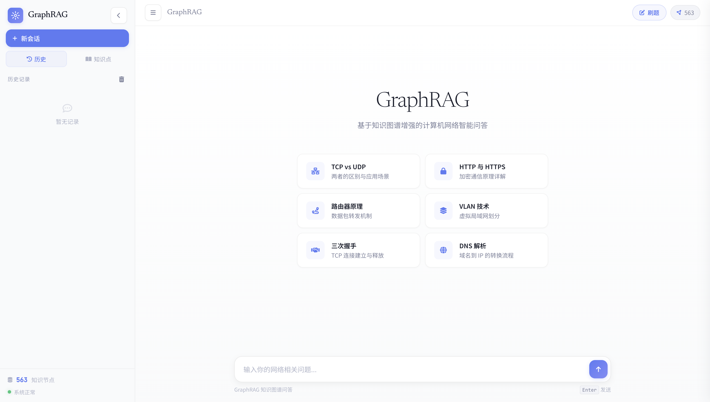

# GraphRAG 计算机网络知识图谱问答系统

基于 Neo4j 图数据库和智谱AI大模型的计算机网络知识问答系统，采用 FastAPI + LangGraph + LangChain 架构，支持混合语义+关键词检索（GraphRAG）、会话记忆和质量监控。

## 项目简介

面向计算机网络领域的智能知识问答系统，核心特性：

- **知识图谱存储** — Neo4j 按 5 层 OSI 模型分层存储协议、设备、概念等知识
- **智能问答** — LangGraph ReAct Agent 自主选择工具（知识搜索、图可视化、统计、节点搜索、邻居探索）
- **混合检索** — Qwen 语义向量检索 + 关键词检索，合并排序返回精准结果
- **会话记忆** — LangGraph MemorySaver 实现多轮对话上下文保持
- **工程化** — pydantic-settings 配置校验、API Key 认证、structlog 结构化日志、tenacity 自动重试
- **质量监控** — 实时监控提取准确率、验证通过率等指标，支持告警和趋势分析
- **Web 界面** — D3.js 交互式图可视化、语音输入、会话管理

## 主页展示



## 技术栈

| 类别 | 技术 |
|------|------|
| 后端 | FastAPI + Uvicorn |
| AI 框架 | LangGraph + LangChain |
| 图数据库 | Neo4j |
| LLM | 智谱AI GLM-4-Flash（ZhipuAI API） |
| Embeddings | Qwen text-embedding-v3（DashScope API，1024 维） |
| 配置管理 | pydantic-settings |
| 日志 | structlog |
| 重试 | tenacity |
| 前端 | HTML5 / CSS3 / JavaScript / D3.js |

## 快速开始

### 环境要求

- Python 3.9+
- Neo4j 4.4+（需 APOC 和向量索引支持）
- 智谱AI API Key
- 通义千问 API Key（用于 Embeddings）

### 安装步骤

1. **克隆项目**
   ```bash
   git clone <repository-url>
   cd aigc
   ```

2. **安装依赖**
   ```bash
   pip install -r requirements.txt
   ```

3. **获取 API Key**
   - 智谱AI：[open.bigmodel.cn](https://open.bigmodel.cn) 注册获取
   - 通义千问：[DashScope 控制台](https://dashscope.console.aliyun.com/) 注册获取

4. **配置环境变量**

   创建 `.env` 文件：
   ```bash
   # Neo4j（必填）
   NEO4J_URI=bolt://localhost:7687
   NEO4J_USER=neo4j
   NEO4J_PASSWORD=your-password

   # 智谱AI LLM（必填）
   ZHIPUAI_API_KEY=sk-your-api-key
   ZHIPUAI_MODEL=glm-4-flash

   # Qwen Embeddings（语义检索必需）
   QWEN_API_KEY=sk-your-api-key
   QWEN_EMBEDDING_MODEL=text-embedding-v3

   # Web（可选）
   WEB_HOST=0.0.0.0
   WEB_PORT=5001
   DEBUG=false

   # API 认证（可选，不设则跳过认证）
   API_KEY=your-secret-key

   # 日志（可选）
   LOG_LEVEL=INFO
   LOG_FORMAT=console

   # 快速启动（可选，跳过初始化延迟到首次查询）
   FAST_START=false
   ```

5. **启动 Neo4j**

   确保 Neo4j 运行中，可通过 http://localhost:7474 访问管理界面

6. **导入知识数据**
   ```bash
   python scripts/build_from_json.py              # 从 data/layers/*.json 导入
   python scripts/build_index_from_docs.py        # 从 PDF 构建（GraphRAG 流水线）
   python scripts/generate_embeddings.py          # 生成 Qwen 向量嵌入
   ```

7. **启动应用**
   ```bash
   python run.py --mode web
   # 自定义参数
   python run.py --mode web --host 0.0.0.0 --port 5001 --debug
   ```

8. **访问** http://localhost:5001

## 系统架构

```
用户提问
    │
    ▼
FastAPI (/api/query)  ←──  web/graph_rag_web.py
  ├── API Key 认证 (middleware.py)
  ├── request_id 注入 (structlog)
  └── 全局异常处理 (exceptions.py)
    │
    ▼
GraphRAGAgent  ←──  src/graphrag_agent.py
  LangGraph ReAct Agent + MemorySaver 会话记忆
  LLM (ZhipuAI) 自主选择工具:
    ├── knowledge_search   → 检索 + 可视化数据
    ├── graph_statistics   → 图统计信息
    ├── node_search        → 关键词节点搜索
    └── node_neighbors     → 节点邻居探索
    │
    ▼
Neo4jGraphRetriever  ←──  src/langchain_retriever.py
  混合检索:
    1. _semantic_search()  → Qwen Embedding + Neo4j 向量索引
    2. _keyword_search()   → 关键词提取 + Cypher CONTAINS
    3. 合并排序 → _build_context() 返回结构化上下文
    │
    ▼
Neo4j 图数据库
  节点: Layer, Entity (Protocol/Device/Concept), Question, Answer
  关系: CONTAINS, ABOUT, RESPONDS_TO, DEPENDS_ON, WORKS_WITH, APPLY_TO
  向量索引: entity_embedding_index (cosine, 1024-dim)
```

## 项目结构

```
aigc/
├── scripts/                # 数据导入脚本
│   ├── build_from_json.py              # JSON → 分层知识图谱
│   ├── build_index_from_docs.py        # PDF → GraphRAG 流水线
│   └── generate_embeddings.py          # 生成向量嵌入
├── src/                    # 核心源代码
│   ├── settings.py                     # 配置中心（pydantic-settings）
│   ├── exceptions.py                   # 自定义异常体系
│   ├── logging_config.py               # 结构化日志（structlog）
│   ├── retry.py                        # 重试策略（tenacity）
│   ├── graphrag_agent.py               # ReAct Agent + 工具 + 会话记忆
│   ├── langchain_retriever.py          # Neo4j 混合检索器
│   ├── langchain_config.py             # 配置兼容层
│   ├── embedding_manager.py            # Qwen Embedding 管理
│   ├── quality_monitor.py              # 质量监控与告警
│   ├── mastery_tracker.py              # 知识掌握追踪（SQLite）
│   └── image_generator.py              # Graphviz 图谱图片生成
├── web/
│   ├── graph_rag_web.py                # FastAPI 应用
│   └── middleware.py                   # API Key 认证中间件
├── templates/
│   └── integrated_index.html           # 主页模板
├── static/
│   ├── js/integrated-app.js            # 前端逻辑
│   ├── js/neo4j-graph.js               # D3.js 图可视化
│   └── css/                            # 样式
├── data/
│   ├── layers/             # 分层知识数据 JSON
│   │   ├── 1_physical.json
│   │   ├── 2_data_link.json
│   │   ├── 3_network.json
│   │   ├── 4_transport.json
│   │   ├── 5_application.json
│   │   └── cross_layer.json
│   └── generated_images/   # Graphviz 生成的图片
├── run.py                  # 启动脚本
└── requirements.txt        # Python 依赖
```

## API 端点

### 问答与会话

| 端点 | 方法 | 描述 |
|------|------|------|
| `/api/query` | POST | 主查询（`{question, session_id?}`） |
| `/api/sessions` | GET | 列出会话 |
| `/api/sessions/new` | POST | 创建会话 |
| `/api/sessions/{id}/history` | GET | 会话聊天历史 |
| `/api/sessions/{id}` | DELETE | 删除会话 |

### 知识掌握

| 端点 | 方法 | 描述 |
|------|------|------|
| `/api/entities` | GET | 获取所有实体（按层分组） |
| `/api/mastery/{session_id}` | GET | 获取掌握状态 |
| `/api/mastery` | POST | 设置掌握状态 |
| `/api/mastery/batch` | POST | 批量设置掌握状态 |

### 图谱操作

| 端点 | 方法 | 描述 |
|------|------|------|
| `/api/graph_stats` | GET | 图统计信息 |
| `/api/search_nodes` | GET | 搜索节点（`?q=keyword`） |
| `/api/node_neighbors/{name}` | GET | 节点邻居 |
| `/api/export_graph` | POST | 导出子图 |
| `/api/generate_image` | POST | 生成 Graphviz 图片 |

### 质量监控

| 端点 | 方法 | 描述 |
|------|------|------|
| `/api/quality_report` | GET | 质量报告 |
| `/api/quality_alerts` | GET | 质量告警 |
| `/api/quality_trends` | GET | 质量趋势 |

### 系统

| 端点 | 方法 | 描述 |
|------|------|------|
| `/api/config` | GET | 功能开关配置 |
| `/api/health` | GET | 健康检查 |
| `/docs` | GET | Swagger 文档 |

## 配置说明

| 变量名 | 说明 | 必填 | 默认值 |
|--------|------|------|--------|
| `NEO4J_URI` | Neo4j 连接地址 | 否 | bolt://localhost:7687 |
| `NEO4J_USER` | Neo4j 用户名 | 否 | neo4j |
| `NEO4J_PASSWORD` | Neo4j 密码 | **是** | - |
| `ZHIPUAI_API_KEY` | 智谱AI API Key | **是** | - |
| `ZHIPUAI_MODEL` | 智谱AI 模型 | 否 | glm-4-flash |
| `QWEN_API_KEY` | Qwen API Key（Embeddings） | 否 | - |
| `QWEN_EMBEDDING_MODEL` | Embedding 模型 | 否 | text-embedding-v3 |
| `DASHSCOPE_API_KEY` | DashScope Key（备选） | 否 | - |
| `API_KEY` | 认证密钥（不设则跳过） | 否 | - |
| `WEB_HOST` | 服务器地址 | 否 | 0.0.0.0 |
| `WEB_PORT` | 服务器端口 | 否 | 5001 |
| `DEBUG` | 调试模式 | 否 | false |
| `LOG_LEVEL` | 日志级别 | 否 | INFO |
| `LOG_FORMAT` | 日志格式（console / json） | 否 | console |
| `FAST_START` | 快速启动 | 否 | false |

### API 认证

设置 `API_KEY` 后，请求头需携带 `X-API-Key: your-secret-key`。白名单路径无需认证：`/`、`/docs`、`/api/health`、`/static/*`。

## 使用说明

### Web 界面

- **智能问答** — 输入计算机网络问题，系统检索知识图谱生成答案并展示图谱可视化
- **图探索** — 搜索节点、点击查看邻居关系、导出子图

### 命令行

```bash
python run.py --mode cli    # 交互式问答
python run.py --mode test   # 运行测试
```

## 常见问题

**启动报配置校验错误** — 确认 `.env` 中已设置 `NEO4J_PASSWORD` 和 `ZHIPUAI_API_KEY`。

**Neo4j 连接失败** — 检查 Neo4j 服务状态、连接地址、用户名密码。

**智谱AI API 调用失败** — 检查 API Key、账户余额、网络连接。

**语义搜索无结果** — 确认已运行 `generate_embeddings.py`，检查 `QWEN_API_KEY` 配置和 `entity_embedding_index` 向量索引。

**系统代理导致 API 失败** — 在 `.env` 中添加：
```bash
NO_PROXY=dashscope.aliyuncs.com,open.bigmodel.cn
```

**回答没有图谱数据** — ReAct Agent 必须调用 `knowledge_search` 工具才返回图谱。Agent 直接回答而跳过工具调用属于 LLM 行为问题。

## 许可证

本项目仅供学习和研究使用。
